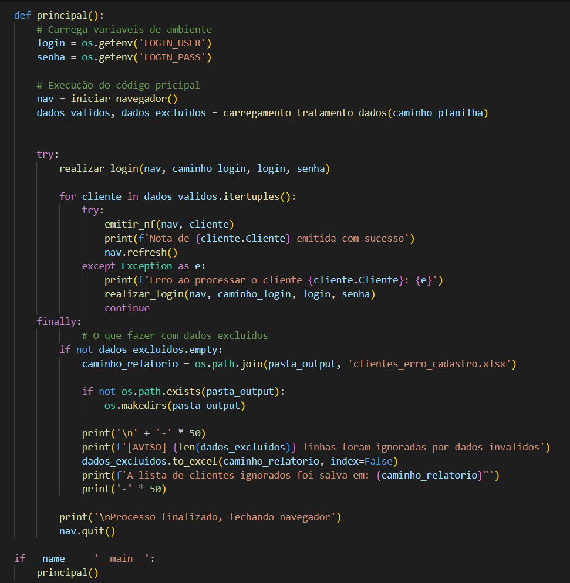
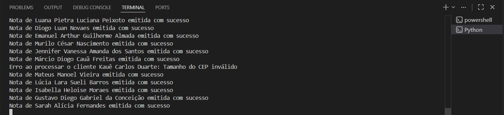
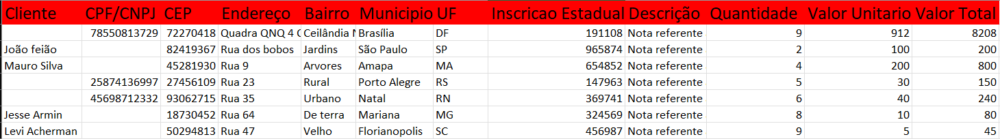
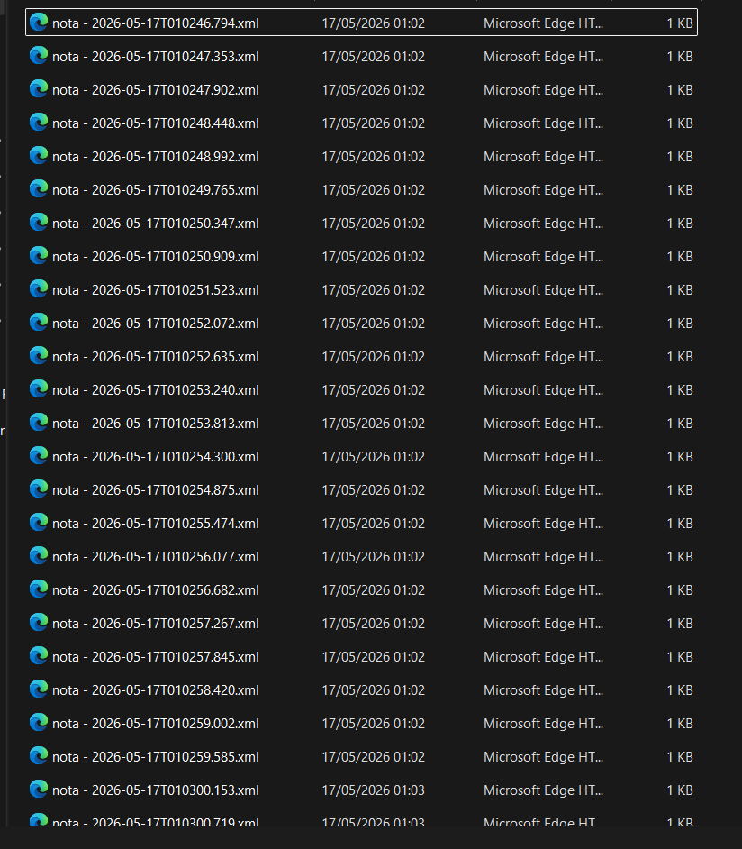

# 📑 Invoice Automation Pipeline

Python-based automation pipeline designed to optimize invoice processing workflows through automated validation, browser interaction and structured data handling.

This project automates the process of reading invoice data from spreadsheets, validating business rules, interacting with a web system, and generating reports for invalid records.

## 🚀 Features
* Automated invoice processing workflow using Selenium
* Spreadsheet processing with Pandas
* Data validation and sanitization
* Headless browser execution
* Automatic handling of invalid records
* Error recovery during automation flow
* Modular project architecture
* Environment variable management with .env
* Automatic generation of output reports

## 🏢 Business Impact
* Reduced repetitive manual tasks
* Improved invoice validation consistency
* Increased operational efficiency
* Automated spreadsheet-based workflows
* Minimized manual data entry errors

## 🛠️ Technologies Used
* Python
* Selenium
* Pandas
* OpenPyXL
* WebDriver Manager
* Python Dotenv

## 📂 Project Structure
```text
invoice-automation-pipeline/
│
├── data/
│   └── NotasEmitir.xlsx
│
├── output/
│   └── clientes_erro_cadastro.xlsx
│
├── web/
│   └── login.html
│
├── src/
│   ├── __init__.py
│   ├── main.py
│   │
│   ├── core/
│   │   ├── __init__.py
│   │   ├── navegador.py
│   │   └── excel.py
│   │
│   └── bot/
│       ├── __init__.py
│       └── acoes.py
│
├── .env
├── .gitignore
├── requirements.txt
└── README.md
```


## ⚙️ Automation Flow
1. Load spreadsheet data
2. Validate required fields
3. Clean and sanitize invoice information
4. Start headless browser
5. Perform system login
6. Execute automated invoice processing workflow
7. Handle processing errors without interrupting execution
8. Export invalid records report
9. Close browser session safely

## 🔍 Data Validation Rules
The automation validates:
* Empty required fields
* Invalid CPF/CNPJ length
* Invalid CEP length
* Invalid invoice values
* Client names containing numbers
Invalid records are automatically separated and exported into an Excel report.

## 🔑 Environment Variables
Create a .env file in the project root:
`LOGIN_USER=your_login`
`LOGIN_PASS=your_password`

## 📥 Installation
1. Clone the repository: `git clone https://github.com/Kiiomaru/invoice-automation-pipeline.git`
2. Access folder: `cd invoice-automation-pipeline`
3. Create venv: `python -m venv venv`
4. Activate (Windows): `.\venv\Scripts\activate`
5. Install: `pip install -r requirements.txt`

## 🚀 Running the Project
Run from root: `python -m src.main`

| System Interaction | Terminal Logs |
|:---:|:---:|
|  |  |

## 📊 Output
The automation automatically generates:
* Downloaded invoice files
* Invalid records report
* Process execution logs in terminal

| Invalid Records (Excel) | Generated Invoices (XML) |
|:---:|:---:|
|  |  |

## 🧠 Main Technical Concepts
* Web Automation
* ETL Concepts
* Data Validation
* Error Handling
* Modular Architecture
* Environment Management
* File System Management
* Resilient Automation Flow

## 📦 Dependencies
* pandas
* selenium
* openpyxl
* python-dotenv
* webdriver-manager

## 👨‍💻 Author
Matheus Giuliano  
Python Automation Developer focused on workflow automation, data processing and operational efficiency.

### 🧠 Focus Areas
- Python Automation
- Workflow Automation
- ETL Pipelines
- Selenium
- Pandas
- SQL
- Process Optimization
