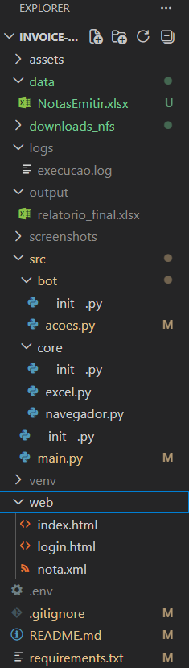
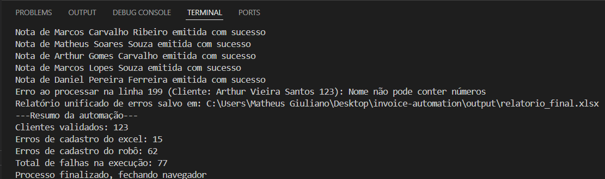
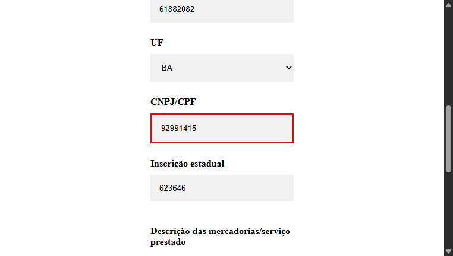
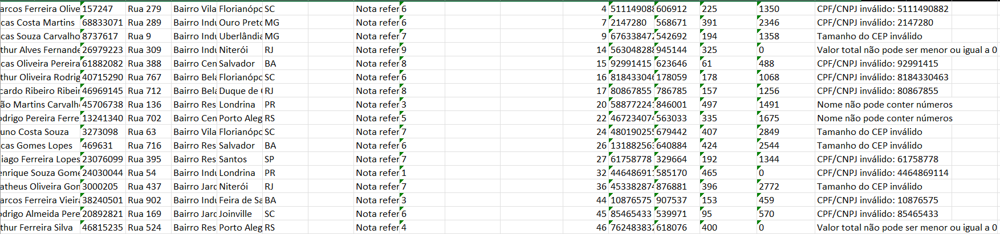

# Invoice Automation

Automação de emissão de notas fiscais desenvolvida com Python, Selenium e Pandas, focada em reduzir processos manuais, aumentar confiabilidade operacional e garantir rastreabilidade durante execuções automatizadas.

O projeto realiza leitura de planilhas Excel, validação e tratamento de dados, preenchimento automatizado de formulários web, captura de erros operacionais e geração de relatórios consolidados para auditoria.

---

# Features

- Automated invoice issuance using Selenium
- Spreadsheet data validation with Pandas
- Structured logging system
- Screenshot capture for failed executions
- Automated error recovery workflow
- Invalid data filtering and reporting
- Environment variable configuration with `.env`
- Automated folder cleanup before execution
- Consolidated execution report generation
- Batch processing workflow

---

# Tech Stack

## Core Technologies

- Python
- Selenium
- Pandas
- WebDriver Manager
- Logging
- Dotenv
- OpenPyXL

## Automation & Data Concepts

- Process Automation
- ETL Workflow
- Data Validation
- Batch Processing
- Error Handling
- Operational Logging
- Data Cleaning
- Workflow Resilience
- Automated Reporting
- Environment Variable Management

## Software Engineering Practices

- Modular Architecture
- Separation of Responsibilities
- Structured Logging
- Reusable Components
- Failure Recovery Strategy
- File System Management

---

# Project Structure

```text
invoice-automation/
│
├── data/
│   └── NotasEmitir.xlsx
│
├── downloads_nfs/
│
├── logs/
│   └── execucao.log
│
├── output/
│   └── relatorio_final.xlsx
│
├── screenshots/
│
├── web/
│   └── login.html
│
├── src/
│   ├── main.py
│   │
│   ├── bot/
│   │   └── acoes.py
│   │
│   └── core/
│       ├── navegador.py
│       └── excel.py
│
├── .env
├── requirements.txt
└── README.md
```

---

# Project Architecture
The repository follows a modular architecture based on Python best practices, ensuring maintainability and scalability.


---
# Business Impact

This project was designed to simulate a real-world operational automation scenario where manual invoice issuance can generate repetitive workload, operational bottlenecks and high risk of human error.

The automation helps optimize business operations by:

- Reducing repetitive manual tasks
- Increasing execution consistency
- Improving operational traceability
- Minimizing invoice processing errors
- Accelerating batch invoice generation
- Improving failure monitoring through logs and screenshots
- Creating standardized execution reports
- Allowing scalable processing workflows

The workflow was structured with reliability and operational continuity in mind, including automatic error recovery and execution persistence.

---

# Workflow

```text
Excel Input
    ↓
Data Validation & Cleaning
    ↓
Automated Login
    ↓
Invoice Form Filling
    ↓
Error Handling & Recovery
    ↓
Logging & Screenshot Capture
    ↓
Final Consolidated Report
```

---

# Data Validation

The automation validates critical information before processing invoices.

Examples:

- Empty customer names
- Invalid CPF/CNPJ length
- Invalid ZIP code length
- Invalid total values
- Missing required fields

Invalid records are automatically separated and exported to a consolidated error report.

---

# Logging System

The project uses Python's `logging` module to provide execution traceability.

Examples of monitored events:

- Successful invoice issuance
- Processing errors
- Execution summary
- Error report generation
- Browser lifecycle
- Automation start and finish

Log file:

```text
logs/execucao.log
```

---

# Error Handling

To improve operational reliability, the automation includes:

- Try/Except workflow
- Automatic screenshot capture
- Execution continuity after failures
- Automatic re-login after processing errors
- Consolidated reporting for failed executions

---

#  Demonstration & Results

The project was validated with a batch of **200 entries**, achieving 100% stability and traceability across both successful and failed execution paths.

# Execution Summary (Terminal)
At the end of each run, the robot provides a detailed statistical summary in the console, allowing for a quick audit of the operation's health.


# Traceability & Reporting
Unlike basic automation scripts, this system prioritizes **exception management**. If a data point fails during the web process, the exact reason is logged in a consolidated Excel file for later manual correction.

| Visual Evidence (Screenshot) | Error Report (Excel) |
| :---: | :---: |
|  |  |

---

# Environment Variables

Create a `.env` file in the project root:

```env
LOGIN_USER=your_login
LOGIN_PASS=your_password
```

---

# Dependencies

Main project dependencies:

```txt
selenium
pandas
python-dotenv
webdriver-manager
openpyxl
```

Example `requirements.txt`:

```txt
selenium==4.32.0
pandas==2.2.3
python-dotenv==1.1.0
webdriver-manager==4.0.2
openpyxl==3.1.5
```

---

# Installation

## Clone repository

```bash
git clone <repository-url>
```

## Access project folder

```bash
cd invoice-automation
```

## Install dependencies

```bash
pip install -r requirements.txt
```

---

# Run Project

```bash
python src/main.py
```

---

# Execution Outputs

During execution, the automation generates:

## Logs

```text
logs/execucao.log
```

## Screenshots

```text
screenshots/
```

## Consolidated Error Report

```text
output/relatorio_final.xlsx
```

---

# Technical Highlights

This project was designed to simulate a real operational automation workflow.

Main focuses:

- Operational reliability
- Error traceability
- Batch processing
- Automated validation
- Failure resilience
- Reusable architecture
- Organized project structure

---

# Author

Matheus Giuliano

Python Developer focused on automation, ETL workflows and data-driven process optimization.

- SQL
- Pandas
- Data Processing
- Business Intelligence
- Workflow Automation
- Python Automation
- Process Optimization
- ETL Pipelines
- Selenium

---

# License

This project is for educational and portfolio purposes.

---


